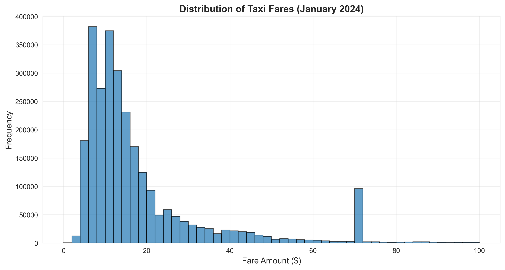
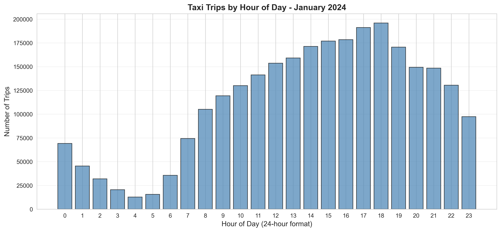
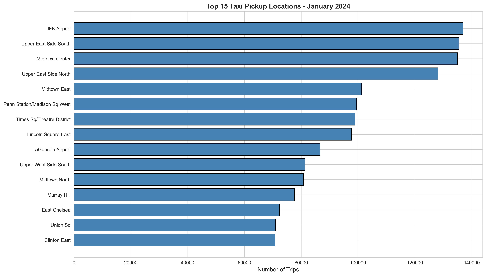
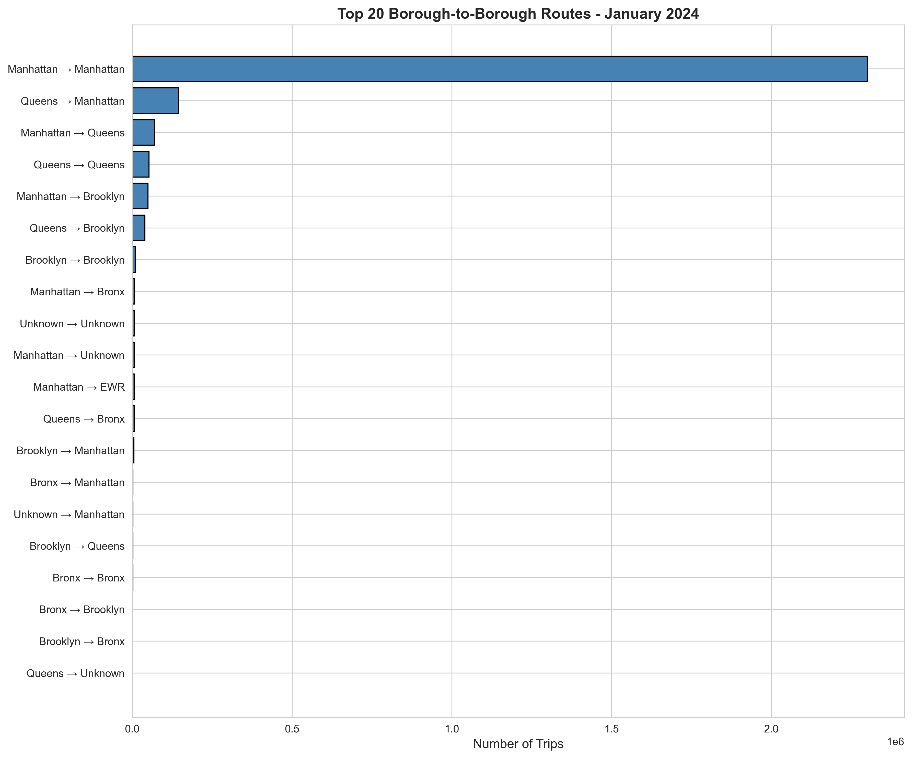

# NYC Taxi Data Analysis

## Project Overview
Comprehensive exploratory data analysis of NYC Yellow Taxi trip records, demonstrating data quality assessment, temporal pattern analysis, geographic insights, and market behavior investigation using Python and pandas.

**Key Skills Demonstrated:** Data cleaning, statistical analysis, visualization, geographic analysis, business insight extraction

---

## Dataset
- **Source:** [NYC Taxi & Limousine Commission (TLC)](https://www.nyc.gov/site/tlc/about/tlc-trip-record-data.page)
- **Period:** January 2024
- **Records:** ~3 million taxi trips
- **Format:** Parquet (compressed columnar storage)
- **Size:** ~50MB compressed

---

## Project Structure
```
nyc-taxi-analysis/
├── data/                          # Raw data files (gitignored)
│   ├── yellow_tripdata_2024-01.parquet
│   └── taxi_zone_lookup.csv
├── src/                           # Analysis scripts
│   ├── load_data.py              # Data loading and initial inspection
│   ├── explore_data.py           # Data quality profiling
│   ├── clean_data.py             # Data cleaning and filtering
│   ├── visualize_data.py         # Basic visualizations
│   ├── time_analysis.py          # Temporal pattern analysis
│   ├── investigate_spike.py      # Anomaly investigation
│   ├── geo_analysis.py           # Geographic zone analysis
│   ├── airport_analysis.py       # Airport pattern comparison
│   └── borough_flows.py          # Inter-borough travel flows
├── docs/figures/                  # Generated visualizations
└── requirements.txt               # Python dependencies
```

---

## Key Findings

### 1. Data Quality Assessment
- **Total records analyzed:** 2,965,989 (after cleaning)
- **Records removed:** 240,487 (8.11%)
- **Quality issues identified:**
  - Negative fares: 37,448 records
  - Zero-distance trips: Significant volume
  - Missing values: ~142,000 records in optional fields
  - Invalid passenger counts and extreme distances

**Cleaning rules applied:**
- Fare amount ≥ $0
- Trip distance: 0-100 miles
- Passenger count: 1-6 people

### 2. Fare Analysis - The $70 Anomaly
**Discovery:** Unusual concentration of ~100,000 trips with fares around $70

**Investigation revealed:**
- Pattern matches JFK Airport flat rate pricing
- Confirmed by RatecodeID = 2 (JFK flat fare)
- Average trip distance: 15-20 miles (consistent with JFK↔Manhattan)
- Demonstrates airport pricing structure in real-world data



### 3. Temporal Patterns

**Peak Hours:**
- Evening rush: 5-7 PM (commuters)
- Late night: 10 PM - 1 AM (entertainment, dining)
- **5 AM spike:** Bar closing time phenomenon

**Hourly fare patterns:**
- Remarkably consistent across 24 hours
- Fixed meter rates prevent surge pricing (unlike rideshares)
- Regulatory pricing structure evident in data



### 4. Airport Analysis - International Flight Signature

**JFK vs LaGuardia Comparison:**

| Metric | JFK | LaGuardia |
|--------|-----|-----------|
| Late-night pickups (10PM-5AM) | 22.0% | 15.6% |
| Average fare | Higher | Lower |
| Trip distance | ~16 miles | ~8 miles |

**Key insight:** JFK's 6.4 percentage point higher late-night activity indicates international red-eye flight arrivals (lower landing fees drive overnight scheduling).

### 5. Geographic Patterns

**Top Pickup Locations:**
1. JFK Airport
2. Upper East Side
3. Midtown Manhattan

**Top Dropoff Locations:**
1. Upper East Side
2. Midtown Manhattan
3. Times Square

**Notable absence:** Airports NOT in top dropoff locations (travelers use alternative transport TO airports vs FROM airports)



### 6. Inter-Borough Flow Analysis

**Critical Discovery - Market Asymmetry:**
- **Queens → Manhattan:** 145,453 trips
- **Manhattan → Queens:** 69,325 trips
- **Ratio:** 2.1:1 imbalance

**Business implications:**
- Yellow cabs effectively operate as one-way airport shuttle INTO Manhattan
- Return trips served by subway, rideshares, other transport
- This asymmetry represents underserved demand that enabled Uber/Lyft market entry
- Demonstrates market failure in traditional taxi model

**Borough dominance:**
- Manhattan: ~90% of all taxi activity
- Queens: ~10% (primarily airport-related)
- Other boroughs: Minimal yellow cab presence



---

## Technologies Used

**Core Libraries:**
- **Python 3.14**
- **pandas 3.10.7** - Data manipulation and analysis
- **matplotlib 3.10.7** - Visualization
- **seaborn 0.13.2** - Statistical visualizations
- **pyarrow** - Parquet file support
- **numpy** - Numerical operations

**Development Tools:**
- Git/GitHub - Version control
- VS Code - Development environment
- Virtual environments - Dependency isolation

---

## Installation & Usage

### Prerequisites
- Python 3.11 or higher
- Git

### Setup
```bash
# Clone repository
git clone https://github.com/n8r8d3r/nyc-taxi-analysis.git
cd nyc-taxi-analysis

# Create virtual environment
python -m venv venv
source venv/Scripts/activate  # Windows Git Bash
# source venv/bin/activate     # Linux/Mac

# Install dependencies
pip install -r requirements.txt
```

### Download Data
1. Download [Yellow Taxi Trip Records - January 2024](https://www.nyc.gov/site/tlc/about/tlc-trip-record-data.page)
2. Download [Taxi Zone Lookup CSV](https://d37ci6vzurychx.cloudfront.net/misc/taxi+_zone_lookup.csv)
3. Place files in `data/` directory

### Run Analysis
```bash
# Basic analysis sequence
python src/load_data.py           # Load and inspect
python src/explore_data.py        # Quality analysis
python src/clean_data.py          # Filter data
python src/visualize_data.py      # Create visualizations
python src/time_analysis.py       # Temporal patterns
python src/geo_analysis.py        # Geographic analysis
python src/airport_analysis.py    # Airport comparison
python src/borough_flows.py       # Inter-borough flows
```

---

## Analysis Insights & Business Value

This project demonstrates several key data analysis capabilities:

1. **Data Quality Engineering:** Systematic identification and handling of data anomalies
2. **Investigative Analysis:** Following data patterns to root causes (e.g., $70 fare spike → JFK flat rate)
3. **Temporal Pattern Recognition:** Understanding time-based behaviors and their drivers
4. **Geographic Analysis:** Spatial pattern identification and interpretation
5. **Market Intelligence:** Extracting business insights from operational data (e.g., asymmetric demand → market opportunity)

**Real-world applications:**
- Fleet optimization and driver positioning
- Demand forecasting
- Pricing strategy analysis
- Service gap identification
- Competitive market analysis

---

## Future Enhancements

**Planned additions:**
- [ ] Machine learning models (fare prediction, demand forecasting)
- [ ] Interactive visualizations (Plotly/Dash dashboard)
- [ ] Weather data integration (impact on taxi demand)
- [ ] Comparison with rideshare data
- [ ] PySpark implementation for scalability
- [ ] Time series forecasting models
- [ ] Anomaly detection algorithms

---

## Author

**Henrik** - Data Engineer  
Transitioning from Informatica/SQL Server to Python-based data engineering

**Background:** 30+ years in data warehousing, ETL, and business intelligence

**Contact:** [GitHub](https://github.com/n8r8d3r)

---

## License
MIT License - See LICENSE file for details

---

## Acknowledgments
- NYC Taxi & Limousine Commission for providing open data
- Python data science community for excellent tools and documentation